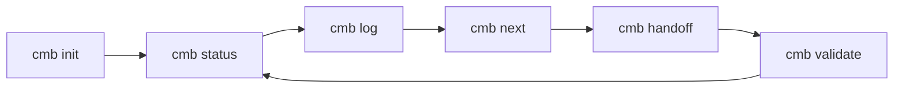
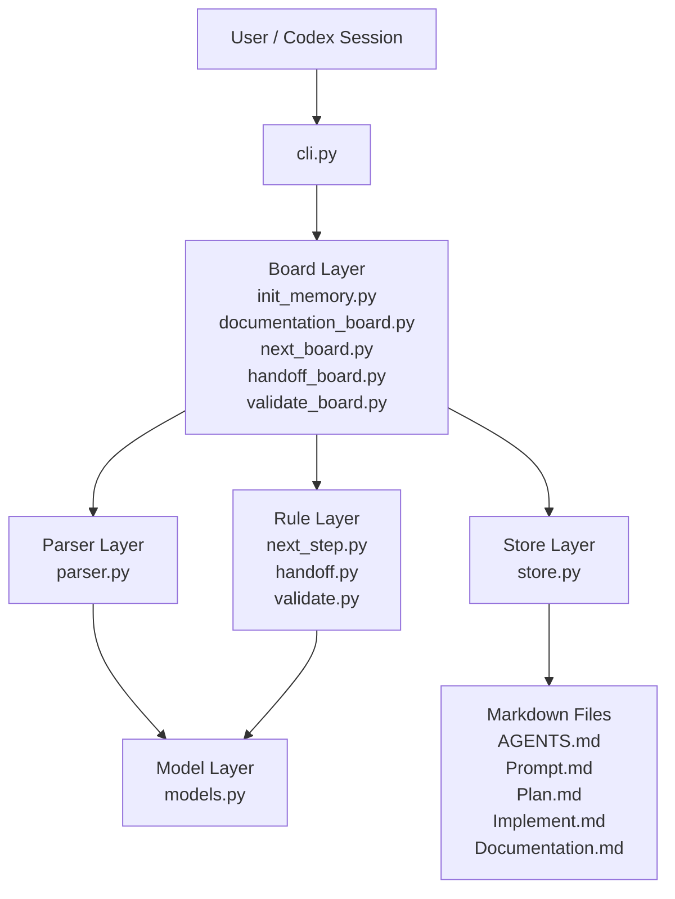
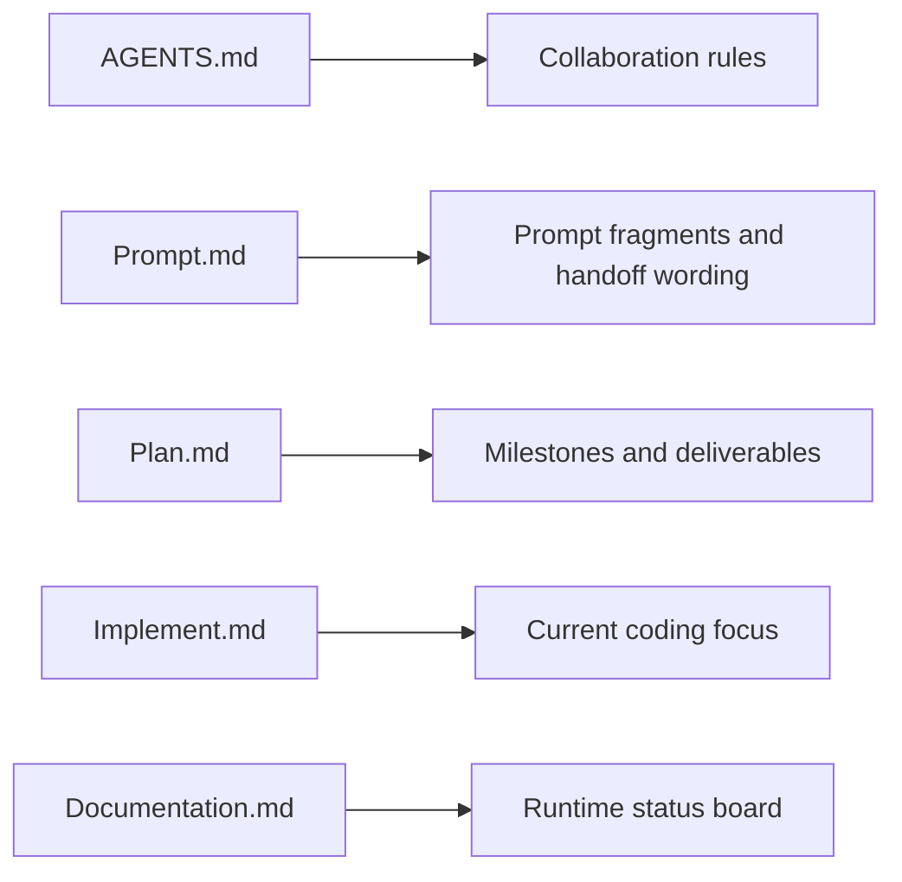
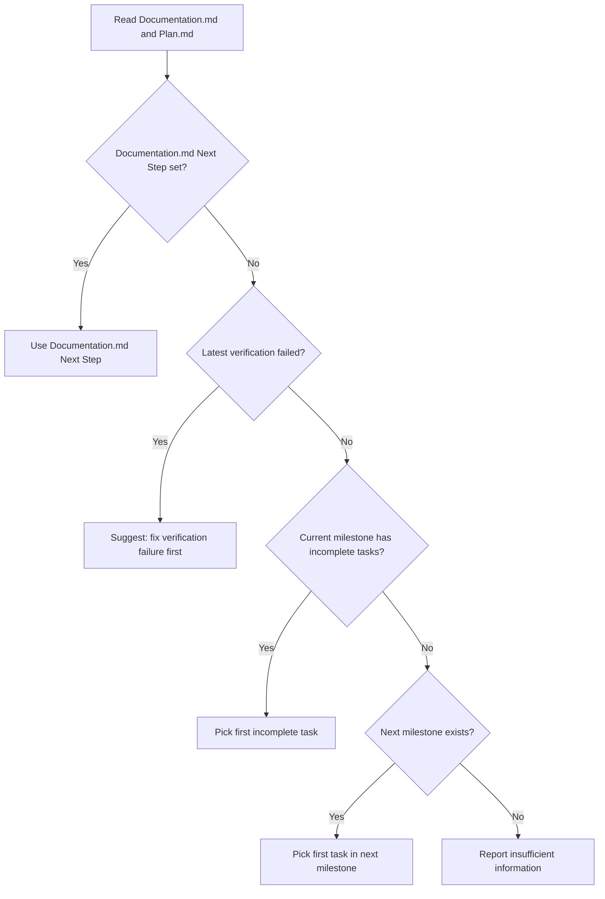
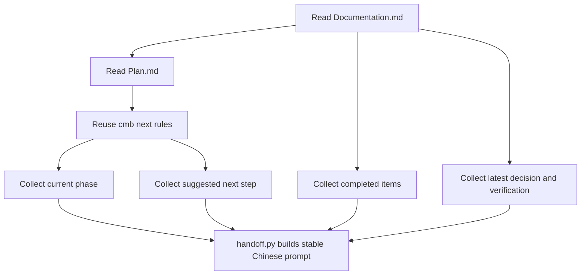
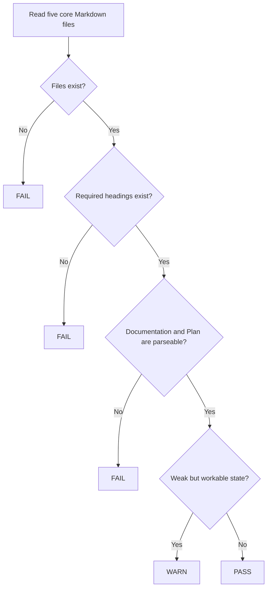
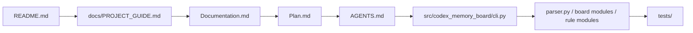
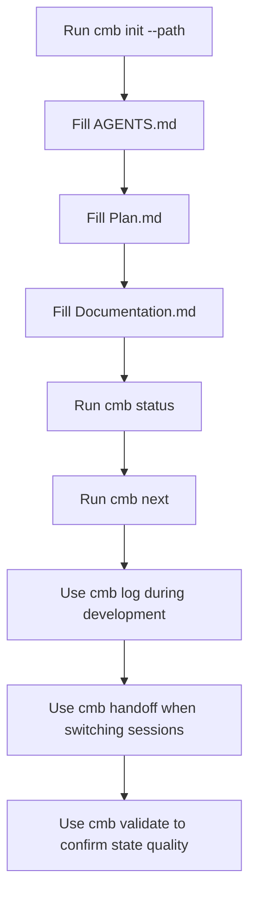

# Architecture Diagrams

This file collects the main diagrams for `Codex Memory Board`.
Use it when you want a fast visual overview before reading the full guide.

## 1. Core Capability Loop

## 2. Runtime Architecture

## 3. File Contract Map

## 4. `cmb next` Decision Flow

## 5. `cmb handoff` Generation Flow

## 6. `cmb validate` Checking Flow

## 7. Recommended Reading Order

## 8. Adopting This Tool In Another Project

