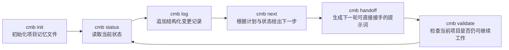
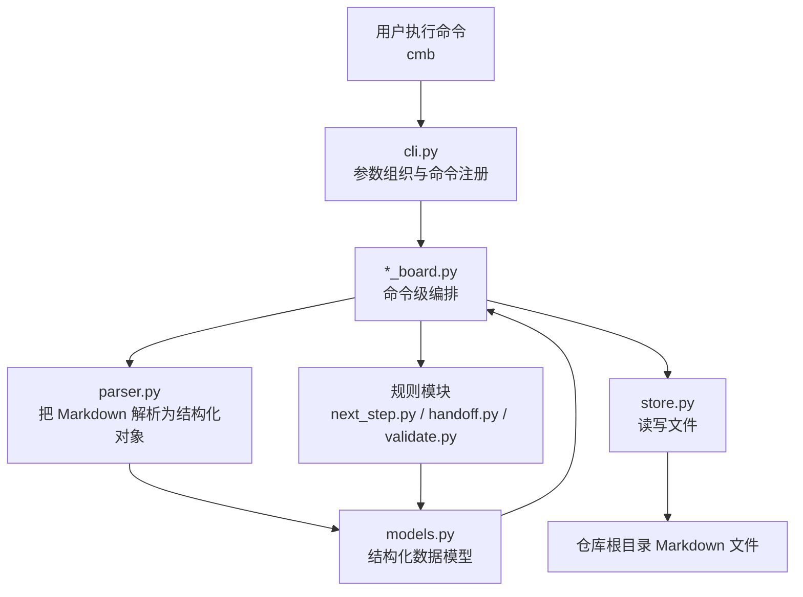
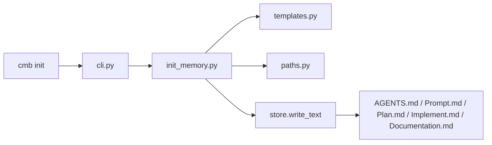
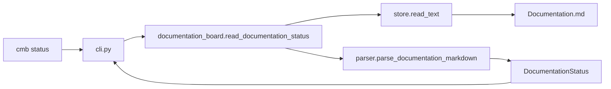
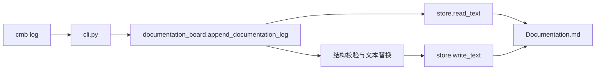
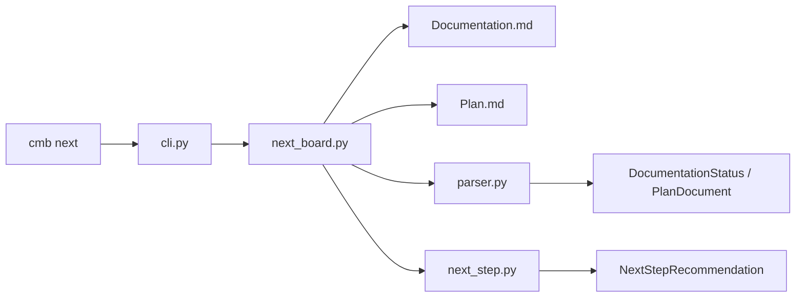
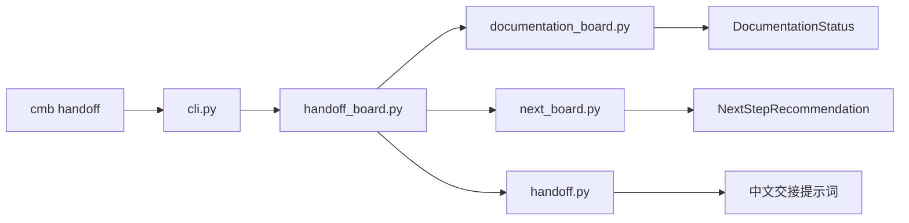
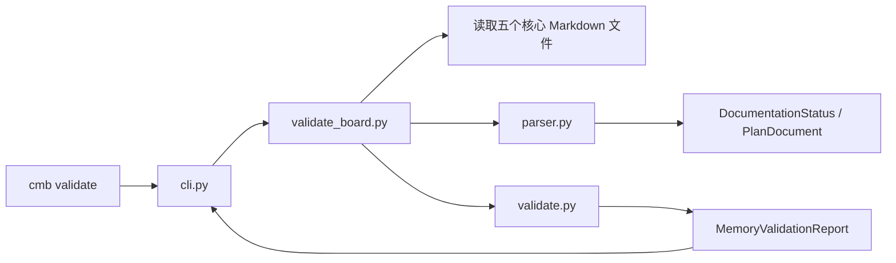

# Codex Memory Board 项目说明书

## 1. 文档目标

这份文档面向第一次接触 `Codex Memory Board` 的人。

阅读完后，你应该能清楚知道：

- 这个项目解决什么问题
- 它不解决什么问题
- 六个命令分别做什么
- 项目内部架构如何分层
- 每个核心文件应该写什么
- 如何把它迁移到你自己的项目里使用
- 当命令报错、建议不合理、状态不一致时，该怎么调试

这不是一份“只讲概念”的介绍文档。
它是一份实际操作手册、架构说明和调试指南的合并版。

如果你想先直接看图，再读正文，请先看 [ARCHITECTURE_DIAGRAMS.md](./ARCHITECTURE_DIAGRAMS.md)。

---

## 2. 项目是什么

`Codex Memory Board` 是一个本地 Python CLI。

它的核心思路不是“给 AI 做长期记忆”，而是把“当前项目是否还能继续工作”这件事显式写进 Markdown 文件里。

它通过五个核心 Markdown 文件，把项目的：

- 协作约束
- 当前计划
- 当前实现焦点
- 当前状态
- 交接提示词

外置成一个人和工具都能直接读写的状态面板。

这个项目的价值在于：

- 长任务不会因为线程切换而完全丢上下文
- 新线程可以快速知道当前阶段、下一步、最近决策和验证情况
- 项目状态不再藏在聊天上下文里，而是落在仓库文件里
- 可以用 `validate` 检查“这个项目现在是否还处于可继续工作的状态”

你也可以把它理解为一种轻量“项目状态架构”：

- 它既是一个本地 CLI 工具
- 也是一套围绕五个 Markdown 文件展开的稳定契约
- 还是一条帮助长任务持续续跑的工作流闭环

换句话说，你在复用它时，不只是复用几个命令，而是在复用一套“项目状态如何落盘、如何读取、如何交接、如何校验”的架构。

---

## 3. 项目不是什么

为了避免误用，先明确边界：

- 它不是通用知识库
- 它不是向量数据库
- 它不是跨项目共享记忆系统
- 它不是自动修复器
- 它不是完整项目管理平台
- 它不是替代 Git、Issue Tracker 或文档站的系统

它只做一件事：

把“当前这个项目是否还可持续推进”所需要的最小状态，以 Markdown 契约的方式保存下来，并提供命令来读、写、推断、交接和校验。

---

## 4. 六个核心能力

当前项目已经实现六个核心能力：

1. `cmb init`
2. `cmb status`
3. `cmb log`
4. `cmb next`
5. `cmb handoff`
6. `cmb validate`

它们之间不是彼此独立的六个功能，而是一条闭环：



如果你只记住一个事实，那就是：

`init` 建立契约，`status/log` 维护状态，`next/handoff` 消费状态，`validate` 负责检查整个闭环是否还成立。

---

## 5. 典型使用场景

### 场景 1：长任务分多轮完成

你今天先写一半，明天继续。
只要今天把状态写到 Markdown 文件里，明天就能用 `status`、`next`、`handoff` 快速恢复上下文。

### 场景 2：Codex 会话切换

你需要开启一个新线程继续当前项目。
先运行 `cmb handoff`，把结果直接交给下一轮。

### 场景 3：项目状态已经有点乱了

你不确定当前文件是否还能支撑继续工作。
先运行 `cmb validate`。
如果是 `FAIL`，先修结构；如果是 `WARN`，再决定要不要补充状态。

### 场景 4：把这个工具用到你自己的仓库里

在自己的项目根目录运行 `cmb init`，再按自己的项目阶段填 `Plan.md` 和 `Documentation.md`，就可以开始使用这套工作流。

---

## 6. 快速上手

### 6.1 环境要求

- Python `3.11+`
- 推荐使用项目内 `.venv`
- 当前仓库的 CLI 入口名是 `cmb`

### 6.2 安装

在仓库根目录：

```powershell
.\.venv\Scripts\Activate.ps1
pip install -e .[dev]
```

### 6.3 查看帮助

```powershell
cmb --help
python -m codex_memory_board --help
```

### 6.4 初始化一套项目记忆文件

```powershell
cmb init
```

或者对另一个项目目录初始化：

```powershell
cmb init --path path/to/your-project
```

### 6.5 核心日常工作流

```powershell
cmb status
cmb log --item "完成 X" --decision "采用 Y 方案" --reason "因为 Z" --verify-command "pytest -q" --verify-result "20 passed"
cmb next
cmb handoff
cmb validate
```

---

## 7. 五个核心 Markdown 文件

仓库根目录的五个 Markdown 文件是这个项目真正的“状态数据库”。

### 7.1 `AGENTS.md`

用途：

- 记录这个仓库的协作原则
- 说明工作边界、阶段约束、命名约定
- 告诉后续线程“这里的协作风格和限制是什么”

建议包含：

- 项目目标
- 当前阶段工作原则
- 协作约束
- 不应做的事情
- 交接注意事项

最小结构建议：

```md
# AGENTS

## Purpose

## Project Summary

## Working Rules

## Constraints

## Handoff Notes
```

### 7.2 `Prompt.md`

用途：

- 存放下一轮提示词模板
- 存放当前任务的 prompt 片段
- 方便 handoff 文本和人工 prompt 组织保持一致

建议包含：

- 当前目标
- 已完成事项
- 下一步
- 可复用的交接提示词模板

最小结构建议：

```md
# Prompt

## Purpose

## Active Prompt Context

## Reusable Handoff Template

## Notes
```

### 7.3 `Plan.md`

用途：

- 定义项目阶段顺序
- 定义当前 milestone
- 定义每个 milestone 的 deliverable
- 为 `cmb next` 和 `cmb handoff` 提供结构化计划来源

建议包含：

- `## Current Milestone`
- `## Milestones`
- 每个阶段用 `### <Milestone Name>`
- 每个 deliverable 用任务清单格式 `- [ ]` 或 `- [x]`

最小可解析结构：

```md
# Plan

## Current Milestone
Phase 3B

## Milestones

### Phase 3A
- [x] Implement `cmb status`
- [x] Implement `cmb log`

### Phase 3B
- [ ] Implement `cmb next`
- [ ] Add tests for `cmb next`
```

### 7.4 `Implement.md`

用途：

- 存放“当前实现工作面”的短期说明
- 说明当前改哪些文件、为什么改、如何验证
- 对开发中的具体实现上下文最有帮助

建议包含：

- 当前关注点
- 关键实现决策
- 预计改动文件
- 验证命令和结果

最小结构建议：

```md
# Implement

## Current Focus

## Decisions

## Files Likely To Change

## Verification
```

### 7.5 `Documentation.md`

用途：

- 是当前项目状态的主视图
- `status`、`log`、`next`、`handoff`、`validate` 都直接或间接依赖它

建议把它理解成：

“项目运行时状态面板”

最小可解析结构：

```md
# Documentation

## Current Status

### Current Phase
Phase 5

### Completed Items
- Item A
- Item B

### Next Step
- Item C

### Latest Decision
- Decision: ...
- Reason: ...

### Latest Verification
- Command: ...
- Result: ...

## Log Entries

### 2026-04-16 09:00:00
- Item: ...
- Decision: ...
- Reason: ...
- Verification Command: ...
- Verification Result: ...
```

---

## 8. 六个命令分别怎么工作

这部分是最重要的“命令视角”。

### 8.1 `cmb init`

职责：

- 初始化五个核心 Markdown 文件
- 给出默认模板
- 默认不覆盖已有文件

输入：

- `--path`，默认当前目录

输出：

- 创建或跳过的文件列表

不会做的事：

- 不推断当前项目状态
- 不填具体业务内容
- 不覆盖已有文件

### 8.2 `cmb status`

职责：

- 读取 `Documentation.md`
- 输出当前阶段、已完成事项、下一步、最近决策、最近验证

输入：

- `Documentation.md`

输出：

- `Current Phase`
- `Completed Items`
- `Next Step`
- `Latest Decision`
- `Latest Verification`

### 8.3 `cmb log`

职责：

- 向 `Documentation.md` 追加一条结构化日志
- 同步更新最近决策和最近验证

输入：

- `--item`
- `--decision`
- `--reason`
- `--verify-command`
- `--verify-result`

输出：

- 成功信息
- 时间戳

它会改动：

- `### Latest Decision`
- `### Latest Verification`
- `## Log Entries`

### 8.4 `cmb next`

职责：

- 读取 `Documentation.md`
- 读取 `Plan.md`
- 用固定规则给出下一步建议

规则顺序：

1. `Documentation.md` 的 `Next Step` 非空时优先
2. 最近一次验证失败时，优先修复验证失败
3. 当前 milestone 有未完成 deliverable 时，取第一个未完成项
4. 当前 milestone 已完成时，取下一 milestone 的第一项任务
5. 信息不足时直接报错

输出：

- 当前阶段
- 判断依据
- 建议下一步

### 8.5 `cmb handoff`

职责：

- 读取当前状态
- 复用 `next` 的结果
- 生成一段可直接复制给下一次 Codex 会话的中文提示词

输出至少包含：

- 当前阶段
- 已完成事项
- 建议下一步
- 执行限制或边界
- 建议先阅读的文件

### 8.6 `cmb validate`

职责：

- 检查五个核心 Markdown 文件是否存在
- 检查是否满足最小结构
- 检查当前状态是否足以支撑 `status`、`log`、`next`、`handoff`
- 输出 `PASS` / `WARN` / `FAIL`

`PASS` 表示：

- 结构完整
- 状态足够支撑继续工作

`WARN` 表示：

- 可以继续工作
- 但记忆质量偏弱，例如：
  - `Latest Decision` 还是 `Not set`
  - `Latest Verification` 还是 `Not set`
  - `Log Entries` 存在但没有实际日志

`FAIL` 表示：

- 缺文件
- 缺关键标题
- 当前阶段或当前 milestone 无法解析
- 当前状态已经不足以支撑核心命令继续工作

---

## 9. 架构总览

这个项目采用非常清楚的分层：

1. CLI 层
2. Board 编排层
3. 规则 / 文本生成层
4. Parser 解析层
5. Store 文件读写层
6. Markdown 文件本体

整体架构图：



这套结构的设计原则是：

- `cli.py` 不写业务
- `store.py` 不写业务判断
- `parser.py` 只做结构解析
- 每个命令的“读取多个文件 + 调用规则 + 整理结果”放在 `*_board.py`
- 纯规则逻辑放在专门模块里

---

## 10. 模块分层详解

### 10.1 CLI 层

文件：

- `src/codex_memory_board/cli.py`
- `src/codex_memory_board/__main__.py`

职责：

- 注册 Typer 命令
- 接收命令行参数
- 调用编排层
- 统一处理用户可见输出和错误退出码

不要在这里做的事：

- 不要直接写 Markdown 解析逻辑
- 不要直接写规则判断
- 不要直接操作复杂文件结构

### 10.2 Board 编排层

文件：

- `src/codex_memory_board/init_memory.py`
- `src/codex_memory_board/documentation_board.py`
- `src/codex_memory_board/next_board.py`
- `src/codex_memory_board/handoff_board.py`
- `src/codex_memory_board/validate_board.py`

职责：

- 为单个命令串联“读文件 -> 解析 -> 调规则 -> 返回结果”
- 保持命令的实际工作流集中在一起

这层最适合放：

- 需要同时读多个文件的流程
- 文件存在性预检查
- 将模型对象装配成规则模块需要的输入

### 10.3 规则层

文件：

- `src/codex_memory_board/next_step.py`
- `src/codex_memory_board/handoff.py`
- `src/codex_memory_board/validate.py`

职责：

- `next_step.py`：根据规则选择下一步
- `handoff.py`：将结构化数据拼成稳定中文提示词
- `validate.py`：根据固定规则产出 `PASS/WARN/FAIL`

特点：

- 应该尽量纯
- 不应直接负责文件 I/O
- 更容易单元测试

### 10.4 Parser 层

文件：

- `src/codex_memory_board/parser.py`

职责：

- 读取固定标题结构
- 将 `Documentation.md` 解析为 `DocumentationStatus`
- 将 `Plan.md` 解析为 `PlanDocument`
- 提供最小的 Markdown 标题提取能力给 `validate`

当前实现特点：

- 不依赖 Markdown AST
- 不依赖第三方 Markdown 解析器
- 只依赖标题和列表规则
- 对 Windows UTF-8 BOM 做了兼容

### 10.5 Store 层

文件：

- `src/codex_memory_board/store.py`

职责：

- `read_text`
- `write_text`
- `append_text`

注意：

`store.py` 故意保持很小，因为一旦把“是否覆盖”“是否有效”“怎么判断下一步”这类逻辑塞进 store，整个项目会很快变脏。

### 10.6 模型层

文件：

- `src/codex_memory_board/models.py`

职责：

- 定义命令之间传递的结构化对象
- 把 Markdown 文本转换成更稳定的数据契约

典型模型包括：

- `DocumentationStatus`
- `DocumentationLogInput`
- `DocumentationLogEntry`
- `PlanDocument`
- `PlanMilestone`
- `PlanTask`
- `NextStepRecommendation`
- `HandoffPromptData`
- `MemoryValidationReport`
- `ValidationFinding`

---

## 11. 项目文件清单与职责

这一节回答“每个文件应该写什么”。

### 11.1 仓库根目录

#### `README.md`

作用：

- 快速入口
- 安装、命令、基础说明

应该写：

- 项目定位
- 快速安装
- 每个命令的简要用法
- 指向详细文档的链接

#### `pyproject.toml`

作用：

- 项目元数据
- 依赖声明
- CLI 入口配置

当前关键点：

- `requires-python = ">=3.11"`
- `project.scripts.cmb = "codex_memory_board.cli:run"`

#### `.gitignore`

作用：

- 忽略虚拟环境、缓存、构建产物

#### `AGENTS.md`

应该写：

- 仓库协作规则
- 阶段约束
- 不要做的事情

#### `Prompt.md`

应该写：

- 当前任务 prompt 上下文
- 可复用 handoff 模板

#### `Plan.md`

应该写：

- 当前 milestone
- milestone 列表
- 每个阶段的任务清单

#### `Implement.md`

应该写：

- 当前实现重点
- 关键实现决策
- 预计改动文件
- 验证方法

#### `Documentation.md`

应该写：

- 当前阶段
- 已完成事项
- 下一步
- 最近决策
- 最近验证
- 日志条目

### 11.2 `src/codex_memory_board/`

#### `__init__.py`

作用：

- 包版本等最小导出

#### `__main__.py`

作用：

- 支持 `python -m codex_memory_board`

#### `cli.py`

作用：

- 注册所有命令

#### `console.py`

作用：

- 极简 Rich 输出封装

#### `paths.py`

作用：

- 统一核心文件名和路径解析

#### `templates.py`

作用：

- 保存 `init` 用到的默认模板内容

#### `store.py`

作用：

- 文件读写

#### `parser.py`

作用：

- `Documentation.md` / `Plan.md` 解析

#### `models.py`

作用：

- 所有结构化对象定义

#### `init_memory.py`

作用：

- `cmb init` 的编排逻辑

#### `documentation_board.py`

作用：

- `status` / `log` 的读写编排

#### `next_board.py`

作用：

- `next` 的文件读取编排

#### `next_step.py`

作用：

- `next` 的规则判断

#### `handoff_board.py`

作用：

- `handoff` 的数据准备

#### `handoff.py`

作用：

- 将结构化数据组织成稳定中文提示词

#### `validate_board.py`

作用：

- `validate` 的文件读取和报告编排

#### `validate.py`

作用：

- 校验规则集合

### 11.3 `tests/`

#### `test_smoke.py`

作用：

- CLI 是否挂载成功
- 命令帮助是否存在

#### `test_cli.py`

作用：

- `init`、`status`、`log` 等命令级行为测试

#### `test_documentation_board.py`

作用：

- 文档状态读写相关的业务测试

#### `test_next_step.py`

作用：

- `next` 的规则顺序测试

#### `test_handoff.py`

作用：

- `handoff` 的输出结构测试

#### `test_validate.py`

作用：

- `PASS/WARN/FAIL` 三类校验测试

---

## 12. 数据流：每个命令到底读写了什么

### 12.1 `init`



### 12.2 `status`



### 12.3 `log`



### 12.4 `next`



### 12.5 `handoff`



### 12.6 `validate`



---

## 13. 如何把它用到你自己的项目里

这部分是“迁移指南”。

假设你有一个自己的项目目录：

```text
my-project/
```

### 第一步：在你的项目根目录初始化记忆文件

```powershell
cmb init --path path/to/my-project
```

### 第二步：按你的项目语义填写五个文件

你不要直接照搬本仓库当前内容。
你应该把它们换成你自己的项目语义。

例如：

- `Plan.md` 里的 milestone 应该是你的真实开发阶段
- `Documentation.md` 里的 `Current Phase` 应该是你当前所在阶段
- `Completed Items` 应该写你已经完成的内容
- `Next Step` 应该写你明确知道的下一步
- `Implement.md` 应该写你当前改哪些文件

### 第三步：开始进入循环

日常使用建议：

1. 开始一轮工作前先 `cmb status`
2. 做完一个清晰动作后 `cmb log`
3. 不确定下一步时 `cmb next`
4. 要切线程时 `cmb handoff`
5. 不确定记忆文件是否还可靠时 `cmb validate`

### 第四步：让你的团队遵守同一份 Markdown 契约

如果多人或多线程都在使用它，最重要的是：

- 不要随意改标题层级
- 不要随意改关键字段名
- 不要把 `Plan.md` 改成无法解析的自由写作格式
- 不要把 `Documentation.md` 改成散文式记录

这个项目的稳定性，来自“有限自由 + 稳定契约”。

---

## 14. 如何为自己的项目设计 `Plan.md`

`Plan.md` 是 `next` 和 `handoff` 的核心输入之一。

### 推荐做法

- milestone 用你项目真正的阶段
- deliverable 写成“可以完成/未完成”的事项
- 粒度不要太粗，也不要细到每个小按钮

推荐示例：

```md
# Plan

## Current Milestone
API Integration

## Milestones

### Setup
- [x] Create project skeleton
- [x] Configure environment

### API Integration
- [ ] Add OpenAI client wrapper
- [ ] Add request/response schema
- [ ] Add integration tests

### UI Refinement
- [ ] Improve form layout
- [ ] Improve error feedback
```

不推荐示例：

```md
### API Integration
- [ ] Do backend
```

问题在于：

- 太粗，`next` 的建议没有行动性

也不推荐：

```md
### API Integration
- [ ] Rename variable a
- [ ] Change line 42
- [ ] Add one comma
```

问题在于：

- 太细，计划失去阶段意义

---

## 15. 如何为自己的项目设计 `Documentation.md`

`Documentation.md` 是运行态主面板。

### 推荐写法

#### `Current Phase`

写“现在在哪个阶段”，不要写含糊状态。

好例子：

- `Phase 3B`
- `API Integration`
- `Release Preparation`

差例子：

- `working`
- `ongoing`
- `some progress`

#### `Completed Items`

写已经确定完成的事项。

好例子：

- Added request schema validation
- Implemented streaming response handling

差例子：

- maybe done
- looked at code

#### `Next Step`

如果你明确知道下一步，就直接写。
因为 `next` 会优先使用它。

#### `Latest Decision`

写最近一次真正影响项目推进的决策。

格式固定为：

```md
### Latest Decision
- Decision: ...
- Reason: ...
```

#### `Latest Verification`

这里尽量写“真实执行过的命令”和结果，不要写模糊词。

例如：

```md
### Latest Verification
- Command: pytest -q
- Result: 20 passed
```

#### `Log Entries`

建议每次完成一个清晰动作就写一条，而不是一天结束才回忆。

---

## 16. 调试指南：当它没有按预期工作时怎么办

这一节是“根据自己的项目去调试”的核心。

### 16.1 `cmb status` 报错

先检查：

1. `Documentation.md` 是否存在
2. 是否包含以下标题：
   - `## Current Status`
   - `### Current Phase`
   - `### Completed Items`
   - `### Next Step`
   - `### Latest Decision`
   - `### Latest Verification`
   - `## Log Entries`

最常见原因：

- 手动改坏了标题层级
- 把 `Documentation.md` 写成自由格式
- 文件名拼错

### 16.2 `cmb log` 失败

先检查：

- `Documentation.md` 的结构是否完整
- `## Log Entries` 是否存在

因为 `log` 不是“随便 append 到文件末尾”，它会先定位这些区块，再更新 `Latest Decision` 和 `Latest Verification`。

### 16.3 `cmb next` 给出的建议不合理

按这个顺序排查：

1. `Documentation.md` 的 `Next Step` 是否写了内容
   - 如果写了，它一定优先
2. `Latest Verification` 是否显示失败
   - 如果失败，`next` 会优先修复失败
3. `Plan.md` 的 `Current Milestone` 是否正确
4. 当前 milestone 的 deliverable 是否太粗或顺序不合理

调试建议：

- 如果你想让 `next` 明确输出某个动作，先更新 `Documentation.md` 的 `Next Step`
- 如果你想让 `next` 更依赖计划，就把 `Next Step` 设为空或 `Not set`

### 16.4 `cmb handoff` 输出太空泛

排查：

1. `Documentation.md` 的 `Completed Items` 是否太少
2. 最近决策是否没有写
3. 最近验证是否没有写
4. `next` 本身是否给出了过于模糊的建议

`handoff` 只是组织输出，不会发明你没写过的信息。

### 16.5 `cmb validate` 是 `WARN`

这通常表示：

- 项目还可以继续工作
- 但状态质量偏弱

常见原因：

- `Latest Decision` 还是 `Not set`
- `Latest Verification` 还是 `Not set`
- 没有真实日志条目

处理建议：

- 先决定是否值得补
- 如果项目马上要交接，建议补
- 如果只是你自己本地短期操作，可以暂时接受

### 16.6 `cmb validate` 是 `FAIL`

这说明：

- 有核心文件缺失，或者
- 关键结构已损坏，或者
- 当前状态已经不足以支撑 `status/log/next/handoff`

建议处理顺序：

1. 先补回缺失文件
2. 再恢复关键标题
3. 再补 `Current Phase` / `Current Milestone`
4. 再重新运行 `cmb validate`

### 16.7 Windows / PowerShell 编码问题

如果你在 Windows 下看到中文输出异常、历史文件出现乱码，优先检查：

- 终端编码
- `Set-Content` 的编码方式
- 文件是否带 UTF-8 BOM

当前解析器已经兼容常见的 UTF-8 BOM 标题问题，但如果你手工写文件时使用了非常特殊的编码方式，仍可能造成显示问题。

实用建议：

```powershell
chcp 65001
```

并尽量使用：

- VS Code UTF-8
- PowerShell 默认 UTF-8
- `Get-Content -Encoding utf8`
- Python 的 `encoding="utf-8"`

---

## 17. 从新人视角看，第一次应该怎么用

如果你是第一次进这个仓库，我建议你按下面顺序操作：

1. 先看 `README.md`
2. 再看这份 `docs/PROJECT_GUIDE.md`
3. 再看：
   - `Documentation.md`
   - `Plan.md`
   - `AGENTS.md`
4. 运行：
   - `cmb status`
   - `cmb next`
   - `cmb validate`
5. 如果你准备开始干活，再看：
   - `Implement.md`
   - `src/codex_memory_board/cli.py`
   - 你这次会涉及的 board / rule 模块

最不推荐的方式是：

- 一上来就从某个函数细节开始读
- 不看 Markdown 状态文件就直接动代码

因为这个项目的“真正当前状态”首先在 Markdown 文件里，而不是在 Python 代码里。

---

## 18. 从维护者视角看，新增能力应该怎么扩展

虽然当前六个核心命令已经完成，但未来如果你要扩展，请遵守现有架构。

推荐顺序：

1. 先定义 Markdown 契约
2. 再定义模型
3. 再补 parser
4. 再写 board 编排
5. 再写规则模块
6. 最后接到 `cli.py`

不要反过来从 CLI 直接开写。

新增命令时，推荐问自己这几个问题：

1. 它要读哪些 Markdown 文件？
2. 它会不会写文件？
3. 它的规则应该放在哪一层？
4. 它是否破坏现有固定结构？
5. 它能不能被 `validate` 描述为“可继续工作”？

---

## 19. 项目当前推荐阅读顺序

如果你想完整理解代码架构，推荐按这个顺序阅读：

1. `README.md`
2. `docs/PROJECT_GUIDE.md`
3. `src/codex_memory_board/cli.py`
4. `src/codex_memory_board/models.py`
5. `src/codex_memory_board/paths.py`
6. `src/codex_memory_board/store.py`
7. `src/codex_memory_board/parser.py`
8. `src/codex_memory_board/documentation_board.py`
9. `src/codex_memory_board/next_step.py`
10. `src/codex_memory_board/handoff.py`
11. `src/codex_memory_board/validate.py`
12. `tests/`

---

## 20. 总结

这个项目的核心不是“命令多”，而是“结构稳定”。

你真正需要记住的只有三件事：

1. 五个 Markdown 文件是项目状态契约
2. 六个命令围绕这五个文件形成闭环
3. 代码架构严格分层：CLI、board、rule、parser、store

如果你想把它用于自己的项目，最重要的不是修改代码，而是先把：

- `Plan.md`
- `Documentation.md`
- `AGENTS.md`

按你自己的项目语义写对。

一旦这三份文件写稳，剩下四个文件和六个命令都会开始变得非常顺手。
